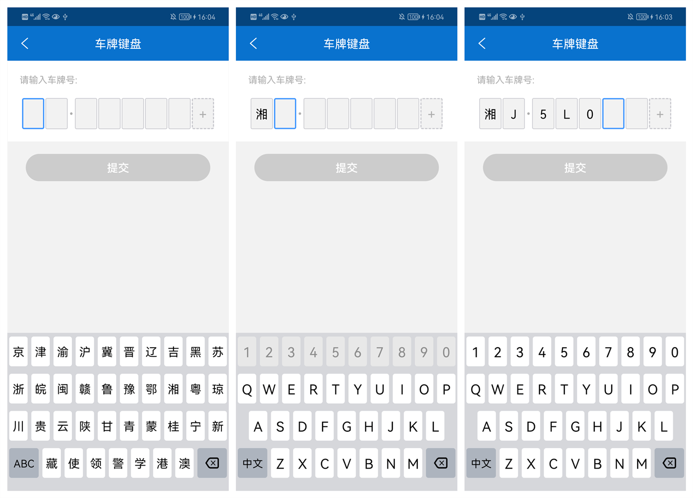
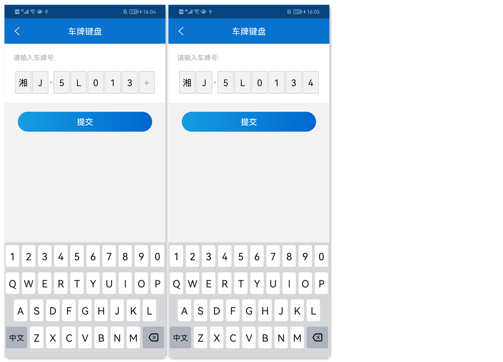

# CarNumKeyboard 车牌键盘

Android输入车牌号的自定义键盘及输入方框。


## 效果展示

未输入时展示省份键盘、输入第二位城市编码时禁用数字键盘、输完城市编码再启用数字键盘:




默认是非新能源的7位车牌、点击加号变成新能源8位车牌:




## 使用方式

建议直接源码依赖，方便自己按需求修改:
```groovy
implementation project(path: ':library-car-num')
```


参照demo中的使用方式：

```java
Button btnSubmit = findViewById(R.id.btn_submit);
CarNumView carNumView = findViewById(R.id.car_num_view);
TextView tvBtnAdd = findViewById(R.id.tv_btn_add);

tvBtnAdd.setOnClickListener(v -> {
      tvBtnAdd.setVisibility(View.GONE);
      //点击Add按钮后允许输入的最大字符长度变为8个
      carNumView.getEditText().setMaxCnt(8);
});

btnSubmit.setEnabled(false);
btnSubmit.setOnClickListener(v -> {
    //获取当前输入内容
    String carNumber = carNumView.getInputContent();
    if(!carNumber.isEmpty()) {
        Toast.makeText(this, carNumber, Toast.LENGTH_LONG).show();
    }
});

CarNumHelper carNumHelper = new CarNumHelper(carNumView.getEditText(),
    newInput -> btnSubmit.setEnabled(newInput.length() >= 7));
//显示车牌键盘
carNumHelper.showCustomKeyboard();
```


偷了个懒:)，最后的Add按钮是按尾部对齐直接盖在输入框上的，正好挡住了第8位输入框：

```xml
<androidx.constraintlayout.widget.ConstraintLayout
    android:id="@+id/container_top"
    android:layout_width="match_parent"
    android:layout_height="wrap_content">
    <com.daemon.won.keyboard.car.CarNumView
        android:id="@+id/car_num_view"
        android:layout_width="wrap_content"
        android:layout_height="wrap_content"
        app:layout_constraintTop_toBottomOf="@id/tv_tips"
        app:layout_constraintLeft_toLeftOf="parent"
        app:layout_constraintRight_toRightOf="parent"
        android:layout_marginTop="20dp"
        app:box_text_color="@color/black_03"
        app:box_text_size="20sp"
        app:box_width="36dp"/>
    <TextView
        android:id="@+id/tv_btn_add"
        android:layout_width="36dp"
        android:layout_height="50dp"
        app:layout_constraintTop_toTopOf="@id/car_num_view"
        app:layout_constraintBottom_toBottomOf="@id/car_num_view"
        app:layout_constraintRight_toRightOf="@id/car_num_view"
        android:gravity="center"
        android:text="+"
        android:textSize="22sp"
        android:textColor="@color/gray_ae"
        android:background="@drawable/won_layer_list_add_bg"/>
</androidx.constraintlayout.widget.ConstraintLayout>
```


## 注意事项

仅供学习使用，不要用于商业场景。
要求创建CarNumView所持有的Context是Activity, 否则无法正常弹出车牌号输入法，暂时未修复这个问题。


## 致谢

感谢[VehicleEditText](https://github.com/relish-wang/VehicleEditText) 及 [VerificationCodeView](https://github.com/JackTuoTuo/VerificationCodeView) ，在他们的基础上调整修改，整合出此版本的车牌输入框及键盘。

